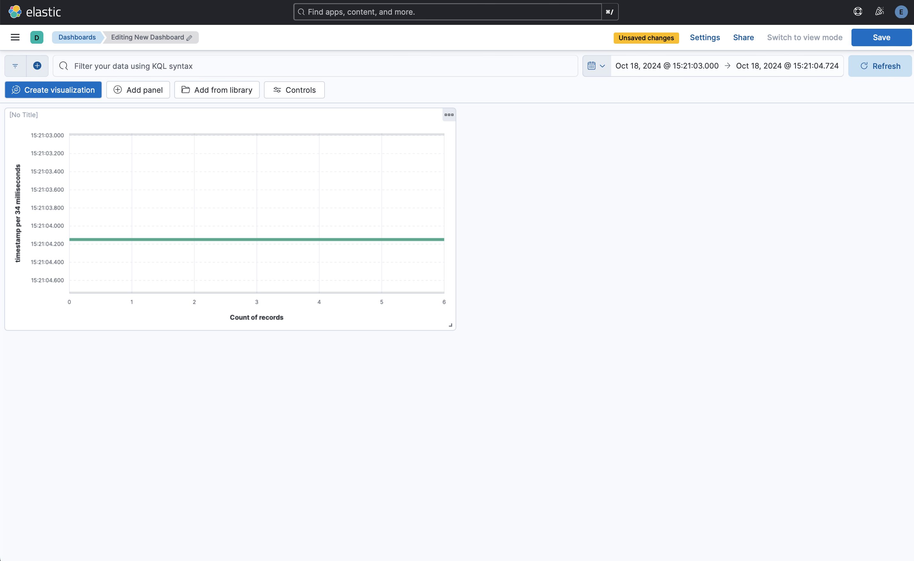
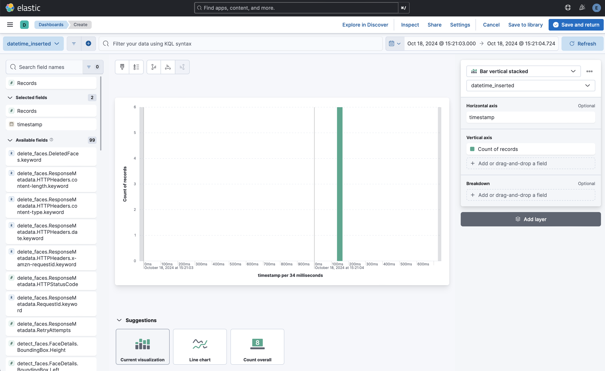

## Running Elasticsearch and the Project

### Prerequisites
1. Ensure you have Docker and Docker Compose installed on your machine.
2. Clone this repository onto your local machine using the following command:
   ```sh
   git clone https://github.com/denysmalykhin/elasticsearch-pipeline.git
   ```
3. Navigate to the cloned repository directory:
   ```sh
   cd elasticsearch-pipeline
   ```

### Step 1: Initialize the Elasticsearch Users and Groups
Before starting the stack, initialize the Elasticsearch users and groups required by elasticsearch-pipeline by executing the following command:
   ```sh
   docker compose up setup
   ```

### Step 2: Start the Stack
If the setup completed without errors, start the other stack components with the following command:
   ```sh
   docker compose up
   ```

> [!NOTE]
> You can also run all services in the background (detached mode) by appending the `-d` flag to the above command:
   ```sh
   docker compose up -d
   ```

### Step 3: Access Kibana
Give Kibana about a minute to initialize, then access the Kibana web UI by opening <http://localhost:5601> in a web browser. Use the following (default) credentials to log in:
* user: *elastic*
* password: *changeme*

> [!NOTE]
> Upon the initial startup, the `elastic`, `logstash_internal` and `kibana_system` Elasticsearch users are initialized with the values of the passwords defined in the [`.env`](.env) file (_"changeme"_ by default). The first one is the [built-in superuser][builtin-users], the other two are used by Kibana and Logstash respectively to communicate with Elasticsearch. This task is only performed during the _initial_ startup of the stack. To change users' passwords _after_ they have been initialized, please refer to the instructions in the next section.

### Step 4: Stopping the Stack
To stop the stack, run the following command:
   ```sh
   docker compose down
   ```

### Step 5: Cleanup
To remove all containers, networks, and volumes associated with the stack, run the following command:
   ```sh
   docker compose down -v
   ```

## Running Metadata Operations

To run the download and upload metadata operations, you can use the provided commands:

```sh
python3 -m src.upload_metadata src/test_data/A1
python3 -m src.download_metadata 2024-01-01 2024-01-31 src/test_data/A2
```

This script will download metadata from the provided URL and upload it to Elasticsearch.

Run tests to check the functionality:

```sh
python3 -m unittest tests.test_download_metadata
python3 -m unittest tests.test_upload_metadata
```


## How to Create a Dashboard and Visualize Data with Kibana

### Step 1: Upload Data to Elasticsearch
1. Ensure your Elasticsearch instance is running.
2. Use the Kibana Dev Tools or any other method to upload your data to an Elasticsearch index. For example, you can use the following command in Kibana Dev Tools to upload a JSON file:
   ```json
   POST /your_index/_bulk
   { "index" : { "_index" : "your_index", "_id" : "1" } }
   { "field1" : "value1", "field2" : "value2", "date" : "2024-01-01T00:00:00Z" }
   ```

### Step 2: Create a Visualization
1. Navigate to the **Dashboards** section in Kibana.
2. Press **Create visualization** button.
3. Click on Dropdown menu from the left upper corner and select **Create a data view**.
4. Input name for dataview, the index pattern you created earlier (e.g., `metadata_index`) and timestamp field (e.g., `timestamp`).
5. In the **Available fields** dropdown menu select **timestamp** field.

### Step 3: Configure the visualization
1. In the right side menu select any pre-configured visualization type.
2. On the right bottom corner set desired time range for the visualization.
3. After you finished with the configuration, press **Save and return** button.
4. Add few more visualizations to the dashboard and press **Save** button.




# elasticsearch-pipeline
